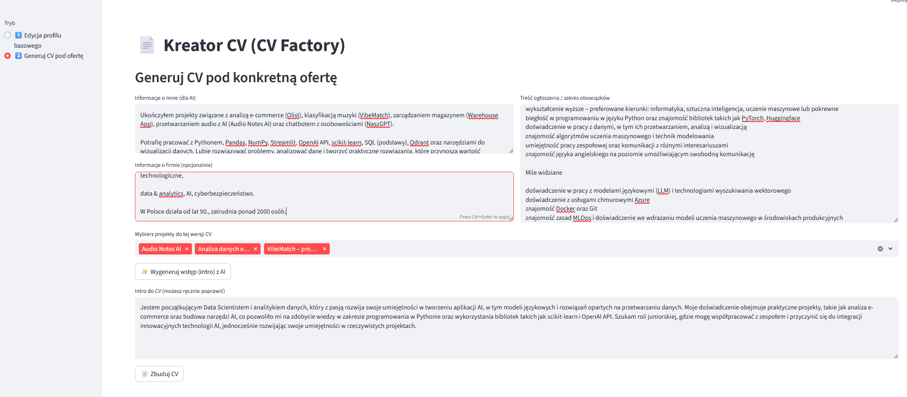

📄 CV Creator (Python)

CV Creator to aplikacja napisana w Pythonie, która automatycznie generuje
✨ czyste, ATS-friendly CV w formacie Markdown,
dopasowane do konkretnej oferty pracy.

Projekt powstał z potrzeby automatyzacji jednego z najbardziej powtarzalnych etapów rekrutacji — ręcznego poprawiania CV pod każde ogłoszenie 😅
Dzięki wykorzystaniu AI oraz modułowej struktury danych, CV można szybko edytować, rozszerzać i eksportować do PDF.

🚀 Co potrafi aplikacja?

✅ Generuje profesjonalne podsumowanie CV z użyciem AI
✅ Buduje CV w sposób modułowy (projekty, doświadczenie, umiejętności)
✅ Tworzy czysty Markdown, gotowy do eksportu do PDF
✅ Ułatwia szybkie dopasowanie CV do konkretnej oferty
✅ Oddziela logikę danych od warstwy prezentacji

🧠 Dlaczego ten projekt jest istotny?

Projekt pokazuje praktyczne wykorzystanie:

🔹 integracji OpenAI API
🔹 pracy na ustrukturyzowanych danych (JSON)
🔹 generowania treści pod realny problem rekrutacyjny
🔹 myślenia produktowego: automatyzacja, reużywalność, prostota

📌 To narzędzie, które sam realnie wykorzystuję w procesie aplikowania o pracę.

🛠️ Stack / technologie

🐍 Python

🤖 OpenAI API

📝 Markdown

🧩 JSON

🌿 Git

📌 Status projektu

🟢 Working version
Projekt działa, generuje CV i jest dalej rozwijany.

## 📸 Screenshot aplikacji

