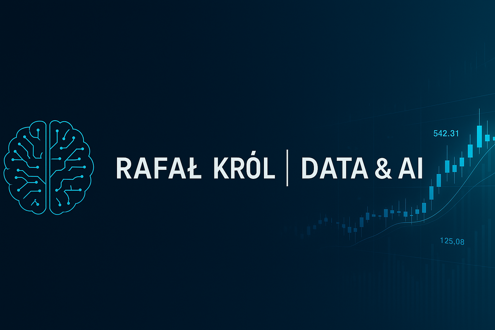

# Cześć, tu Rafał 👋

Witaj w moim **portfolio Data & AI** – zbiorze analiz danych, projektów z kursu *„Od Zera do AI”* oraz własnych eksperymentów z aplikacjami.

---

## Co tu znajdziesz?

- 📊 **Projekty EDA** – od klasycznych zbiorów (Irysy) po dane e-commerce (Olist)
- 🌍 **Aplikacje** 

- 🤖 NaszGPT – interaktywny czat z AI, z wyborem osobowości i zapisem historii rozmów.

- 🎶 VibeMatch – muzyczno-nastrojowa aplikacja, zmienia tło i rekomenduje muzykę dopasowaną do nastroju użytkownika.

- 🧭 QuestApp – habit-tracker RPG, z questami, streakami i systemem poziomów.

- 👫 Find-Friends – aplikacja ML wyszukująca osoby podobne na podstawie klasteryzacji danych.

- 🔥 Urban Heat Island (UHI) – projekt mapujący wyspy ciepła na podstawie danych satelitarnych.

- 🧘 Mind & Motywator (2 pokoje) – aplikacja wspierająca zdrowe nawyki i uważność:

- 💧 Motywator Zdrowia – liczniki wody, aktywności i codziennych nawyków,

- 🧘 Mind – medytacje generowane przez AI + odsłuch audio.

- 📦 Aplikacja Magazynowa – prosta aplikacja w Streamlit do zarządzania stanem magazynu (dodawanie, edycja, zapis danych, tabela, wersja SQLite/Google Sheets).

- 🤖 **Eksperymenty z AI** – integracje z modelami językowymi, prototypy asystentów itp.

- 🧾✨ **CV Creator** to aplikacja oparta na Pythonie, która generuje profesjonalne CV w formacie Markdown na podstawie strukturalnych danych z profilu. Z pomocą AI tworzony jest personalizowany wstęp, a wyniki mogą być eksportowane jako plik PDF.

!!! info "Aktualne prace"
    Portfolio będzie aktualizowane na bieżąco wraz z kolejnymi projektami.
    Obecnie rozwijam m.in. projekt **Urban Heat Island (UHI)** — aplikację analizującą wyspy ciepła na podstawie danych satelitarnych i przetwarzania przestrzennego.

## 🔗 Repozytorium GitHub

Pełny kod aplikacji UHI możesz znaleźć tutaj:  
👉 **[github.com/Baxterini/UHI---app](https://github.com/Baxterini/UHI---app)**

---

## ⭐ Szybki start
Najważniejsze projekty w jednym kliknięciu:

- ➡️ [Olist – E-commerce EDA (Raport PDF)](Olist/Olist_EDA.pdf) 
- ➡️ [NaszGPT – Czat z osobowościami](https://naszgpt.streamlit.app/) 
- ➡️ [VibeMatch – Mood & Music App](https://vibematch-baxterini.streamlit.app/) 
- ➡️ [QuestApp - Health & wealth / mindfulness / rozwój](https://questapp-baxterini.streamlit.app/)
---

## Dlaczego to portfolio powstało?

To miejsce, w którym:

- dokumentuję **naukę i projekty** z obszaru danych i AI  
- pokazuję **praktyczne zastosowania** – od analiz po aplikacje webowe  
- mogę łatwo wysłać jedno **link-portfolio** do rekrutera, klienta lub mentora 😉

Jeśli masz link do tego portfolio – śmiało eksploruj sekcje w menu po lewej / u góry.  
Portfolio będzie się rozwijać wraz z kolejnymi projektami 🚀

---

## O mnie

Od 2023 roku rozwijam się w kierunku **Data Science i AI**. Wcześniej pracowałem w sprzedaży oraz obsłudze klienta — doświadczenie, które nauczyło mnie pracy z ludźmi, procesami i rozwiązywaniem realnych problemów.

Dziś kończę intensywny kurs **Data Science**, a następnie rozpoczynam **kurs tworzenia agentów AI**, aby łączyć analizę danych z praktycznymi aplikacjami wykorzystującymi modele językowe.

Tworzę projekty, które są połączeniem:
- danych i analityki,  
- uczenia maszynowego,  
- Streamlit i budowy aplikacji webowych,  
- integracji AI (OpenAI, modele LLM).  

Stawiam na rozwój, praktykę i budowanie narzędzi, które działają i pomagają innym.

### 📅 Mój rozwój

- **2023** – start fascynacji AI i Pythonem  
- **2024** – intensywna nauka Data Science, pierwsze EDA i aplikacje  
- **2025** – budowanie portfolio, aplikacje AI, kurs agentów AI

